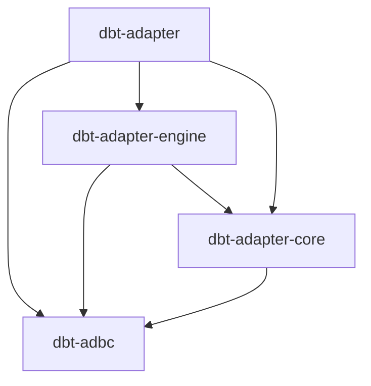

# dbt Adapter Engine

The dbt Adapter Engine (`dbt-adapter-engine`) sits between the `dbt-adapter`
crate implementing all the adapters and the `dbt-adbc` crate responsible for
loading and interfacing with the ADBC drivers.

## Purpose

We should identify and move adapter-agnostic code from `dbt-adapter` into this layer.

It's common for adapter functionality to grow as disjoint implementations (e.g.
Snowflake and BigQuery implemeneting things in different ways). The ADBC
interface creates a uniform layer across data platforms but not everything in a
dbt adapter fits inside a driver. This crate can host the middle-layer between
ADBC drivers and adapter-specific functionality reducing the size of the
`dbt-adapter` crate a little bit.

NOTE(felipecrv): the plan is to move `dbt-adapter/src/engine` here once the
circular dependencies within `dbt-adapter` are worked out into a stand-alone
layer.

## Dependency DAG

Arrows point from a crate to the crates it depends on.

